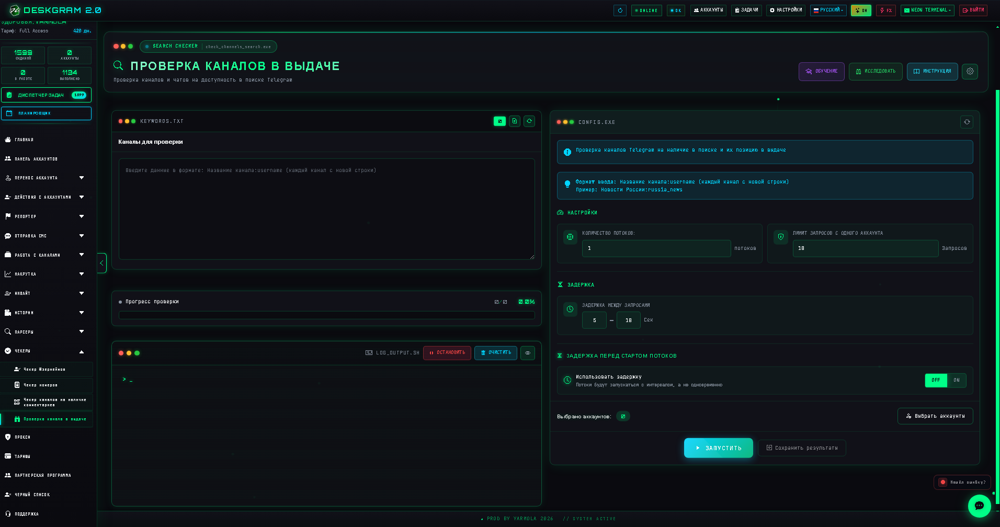
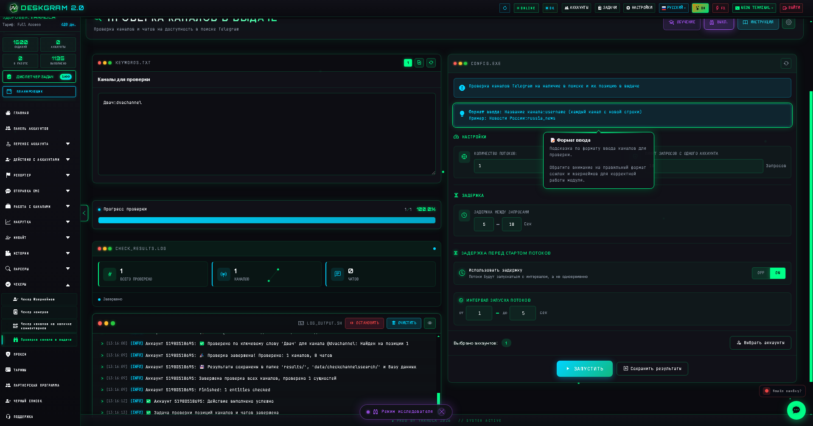
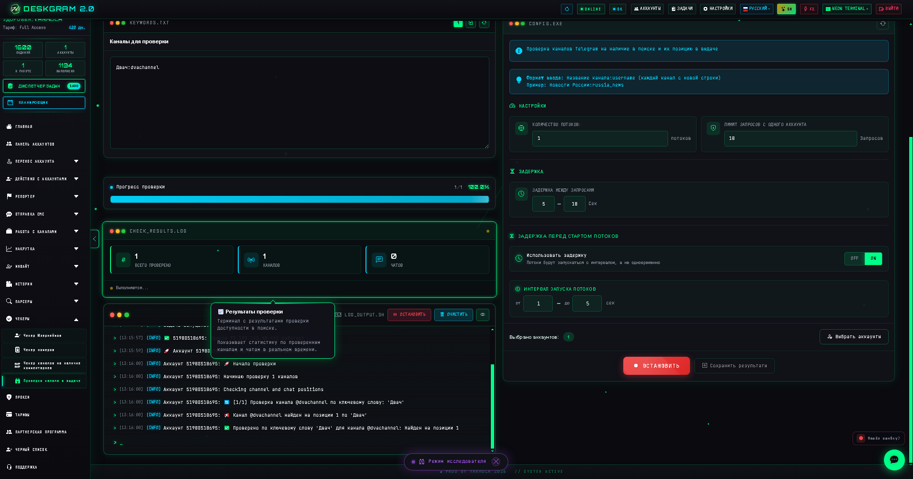
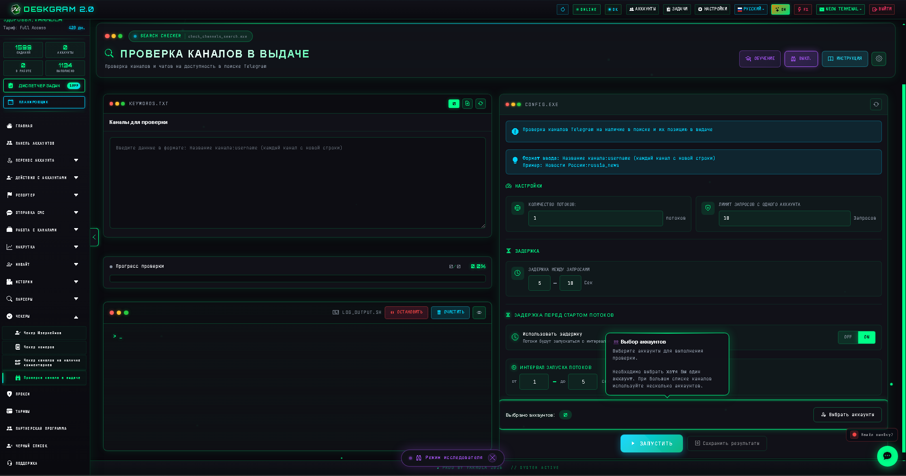

# Проверка каналов в выдаче Telegram через Deskgram 2

Проверка каналов в выдаче Telegram в Deskgram 2 помогает понять, присутствуют ли нужные каналы и чаты в поиске Telegram и как они там обнаруживаются. Модуль полезен, когда discovery уже идет, но нужно отдельно валидировать присутствие площадок в поиске и не держать это на ручной проверке.

[Главный хаб Deskgram 2](https://github.com/Deskgram-2/deskgram-2-telegram-automation) · [Сайт](https://deskgram2.com/) · [Telegram-бот](https://t.me/DG2welcomebot) · [Web preview](https://deskgram2.com/web-preview?path=%2Fapp-demo%2F&lang=ru)

## Интерактивный Web Preview

Попробовать модуль в браузере: [Открыть веб-превью](https://deskgram2.com/web-preview?path=%2Fapp-demo%2Ffunctions%2Fcheck_channels_search&lang=ru)

Это удобно, если хотите заранее увидеть формат входных данных, статистику проверки и выбор аккаунтов.

## Скриншоты

## Кратко о модуле

| Параметр | Что внутри |
|---|---|
| Основная задача | Проверка каналов и чатов на присутствие в Telegram-поиске |
| Важные блоки | Список объектов, статистика, лимиты, задержки, выбор аккаунтов |
| Полезен для | Discovery, проверки видимости площадок, подготовки следующих checker/parser-слоев |
| Связанные модули | Поиск каналов, Чекер комментариев, Диспетчер задач |

## Что умеет модуль

- проверять, доступны ли нужные каналы и чаты в поиске Telegram;
- работать по заранее подготовленному списку объектов;
- показывать статистику по итогам проверки;
- настраивать потоки, лимиты и задержки;
- сохранять результаты для следующих этапов.

## Быстрый старт

1. Подготовьте список каналов в нужном формате.
2. Настройте потоки, лимиты и задержки.
3. Выберите аккаунты.
4. Запустите проверку и дождитесь статистики.
5. Используйте результат в discovery и checker-маршрутах.

## Где этот модуль особенно полезен

- [Поиск каналов и групп](https://github.com/Deskgram-2/telegram-channel-search-deskgram), если после первичного поиска вы отдельно валидируете выдачу;
- [Поиск похожих каналов](https://github.com/Deskgram-2/telegram-similar-channels-deskgram), если сильные источники уже найдены и нужно проверить их присутствие в поиске;
- [Чекер каналов на комментарии](https://github.com/Deskgram-2/telegram-channel-comments-checker-deskgram), если после проверки видимости вы фильтруете площадки по engagement-слою;
- [Диспетчер задач](https://github.com/Deskgram-2/telegram-task-manager-deskgram), если checker-маршруты запускаются централизованно.

## Когда особенно полезен

- когда важно понять, есть ли площадка в Telegram-поиске;
- когда discovery нужно дополнить отдельной валидацией видимости;
- когда вы сравниваете несколько площадок по их доступности в выдаче;
- когда не хочется вручную прогонять каждую ссылку через поиск Telegram.

## Что выбрать: проверку каналов в выдаче или поиск каналов

| Если задача такая | Лучше использовать |
|---|---|
| Нужно сначала найти новые площадки по нише | [Поиск каналов и групп](https://github.com/Deskgram-2/telegram-channel-search-deskgram) |
| Нужно проверить уже подготовленный список на присутствие в поиске | [Проверка каналов в выдаче](https://github.com/Deskgram-2/telegram-search-ranking-checker-deskgram) |
| Нужен discovery-маршрут в две стадии | Сначала поиск каналов, потом проверка в выдаче |
| Нужна валидация качества списка перед следующими checker/parser слоями | Проверка каналов в выдаче |

## Смежные репозитории

- [Главный хаб Deskgram 2](https://github.com/Deskgram-2/deskgram-2-telegram-automation)
- [Поиск каналов и групп](https://github.com/Deskgram-2/telegram-channel-search-deskgram)
- [Поиск похожих каналов](https://github.com/Deskgram-2/telegram-similar-channels-deskgram)
- [Чекер каналов на комментарии](https://github.com/Deskgram-2/telegram-channel-comments-checker-deskgram)
- [Диспетчер задач](https://github.com/Deskgram-2/telegram-task-manager-deskgram)

## FAQ

### Можно ли сначала посмотреть интерфейс до запуска?

Да. Веб-превью уже показывает формат входных данных, статистику и выбор аккаунтов.

### Этот модуль заменяет поиск каналов?

Нет. Он не ищет площадки с нуля, а валидирует уже подготовленный список через отдельный checker-слой.
